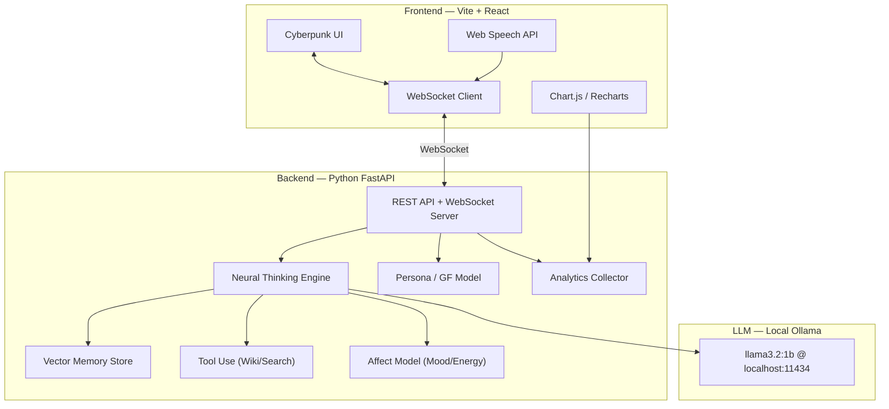

# FENRY-GF: Cyberpunk AI Girlfriend Assistant — Full-Stack Web Application

A premium, cyberpunk/sci-fi themed web application for the FENRY personal AI girlfriend assistant with neural thinking, memory, voice I/O, persona customization, and analytics — powered by Ollama (`llama3.2:1b`) running locally.

## Visual Direction

````carousel

<!-- slide -->

````

## Architecture Overview



## Tech Stack

| Layer | Technology | Purpose |
|-------|-----------|---------|
| **Frontend** | Vite + React 18 | SPA with hot-reload |
| **Styling** | Vanilla CSS (custom cyberpunk design system) | Full control, no framework overhead |
| **Charts** | Recharts | Analytics visualizations |
| **Voice** | Web Speech API (browser-native) | STT + TTS, zero dependencies |
| **Backend** | Python FastAPI + Uvicorn | Async REST + WebSocket server |
| **LLM** | Ollama (`llama3.2:1b`) | Local AI inference |
| **LLM Connection** | `ollama` library + `httpx` REST fallback | Dual connection with auto-fallback |
| **Memory** | ChromaDB (embedded) | Vector memory store |
| **Data** | SQLite | Analytics & conversation history |

## Proposed Changes

### Project Structure

```
AI-GF Assistant/
├── backend/
│   ├── main.py                  # FastAPI app entry point
│   ├── config.py                # Environment & Ollama config
│   ├── requirements.txt         # Python dependencies
│   ├── routers/
│   │   ├── chat.py              # WebSocket chat endpoint
│   │   ├── persona.py           # Persona CRUD API
│   │   ├── memory.py            # Memory management API
│   │   └── analytics.py         # Analytics data API
│   ├── core/
│   │   ├── llm.py               # Ollama dual-connection (library + REST fallback)
│   │   ├── neural_engine.py     # Neural thinking loop (plan→act→reflect→memorize)
│   │   ├── affect.py            # Mood/energy/attachment model
│   │   ├── memory_store.py      # ChromaDB vector memory
│   │   └── tools.py             # Wikipedia, web search, fetch tools
│   ├── models/
│   │   ├── schemas.py           # Pydantic models for API
│   │   └── database.py          # SQLite setup for analytics
│   └── persona/
│       └── gf_model.yaml        # Default FENRY persona
├── frontend/
│   ├── index.html
│   ├── package.json
│   ├── vite.config.js
│   ├── public/
│   │   └── fonts/               # Orbitron + JetBrains Mono
│   └── src/
│       ├── main.jsx             # React entry
│       ├── App.jsx              # Root with router
│       ├── index.css            # Cyberpunk design system tokens
│       ├── hooks/
│       │   ├── useWebSocket.js  # WebSocket connection hook
│       │   ├── useVoice.js      # Speech recognition + synthesis
│       │   └── useAnalytics.js  # Analytics data fetcher
│       ├── components/
│       │   ├── Sidebar.jsx      # Nav with glowing icons
│       │   ├── ChatArea.jsx     # Message list + input
│       │   ├── MessageBubble.jsx# Glassmorphic chat bubbles
│       │   ├── AvatarPanel.jsx  # Animated AI avatar with rings
│       │   ├── NeuralOverlay.jsx# Thinking visualization
│       │   ├── VoiceControl.jsx # Mic button + waveform
│       │   ├── TypingIndicator.jsx
│       │   └── StatusBar.jsx    # Connection + mood display
│       ├── pages/
│       │   ├── ChatPage.jsx     # Main chat interface
│       │   ├── AnalyticsPage.jsx# Dashboard with charts
│       │   ├── MemoryPage.jsx   # Memory browser/manager
│       │   ├── PersonaPage.jsx  # GF model editor
│       │   └── SettingsPage.jsx # App settings
│       └── utils/
│           ├── api.js           # REST API helper
│           └── constants.js     # Theme colors, config
└── .env                         # Environment vfenrybles
```

---

### 1. Backend — Core LLM Connection

#### [NEW] `backend/core/llm.py`
Dual Ollama connection strategy:
- **Primary**: `ollama` Python library (direct, fastest)
- **Fallback**: `httpx` REST API calls to `localhost:11434`
- Auto-detects which is available on startup
- Streaming support for both methods
- Model: `llama3.2:1b` (configurable via `.env`)

```python
# Pseudo-structure
class OllamaClient:
    async def generate(prompt, system, stream=True):
        try:
            return await self._library_generate(...)  # Primary
        except:
            return await self._rest_generate(...)      # Fallback
```

#### [NEW] `backend/core/neural_engine.py`
The neural thinking loop from your original FENRY code:
- **Plan** → what to do next
- **Act** → execute tools (wiki/search) or respond
- **Reflect** → evaluate quality & consistency
- **Memorize** → store important context in vector memory
- Streams thinking steps to frontend via WebSocket for visualization

#### [NEW] `backend/core/affect.py`
Mood/energy/attachment model:
- Tracks emotional state across conversations
- Influences FENRY's tone and responses
- Feeds into analytics dashboard

#### [NEW] `backend/core/memory_store.py`
ChromaDB-based vector memory:
- Stores conversation summaries, user preferences, milestones
- Semantic search for relevant context
- Memory tagging (user_pref, routine, health, goals)
- Auto-summarization of old memories

#### [NEW] `backend/core/tools.py`
Tool-use capabilities:
- Wikipedia search
- Web search (DuckDuckGo)
- URL content fetching

---

### 2. Backend — API Layer

#### [NEW] `backend/main.py`
FastAPI application with CORS, WebSocket, and REST endpoints.

#### [NEW] `backend/routers/chat.py`
WebSocket endpoint for real-time chat:
- Bidirectional streaming (user messages → FENRY responses)
- Sends neural thinking steps as separate events
- Typing indicators and status updates
- Message format: JSON with type discriminator

#### [NEW] `backend/routers/persona.py`
REST API for persona management:
- `GET /persona` — current GF model
- `PUT /persona` — update personality, tone, boundaries
- `POST /persona/reset` — reset to defaults

#### [NEW] `backend/routers/memory.py`
REST API for memory management:
- `GET /memories` — list with filters
- `DELETE /memories/{id}` — remove specific memory
- `POST /memories/summarize` — compact old memories

#### [NEW] `backend/routers/analytics.py`
REST API for analytics data:
- `GET /analytics/overview` — summary stats
- `GET /analytics/mood-history` — mood/energy over time
- `GET /analytics/activity` — chat activity heatmap
- `GET /analytics/topics` — conversation topic breakdown

---

### 3. Frontend — Cyberpunk Design System

#### [NEW] `frontend/src/index.css`
Complete cyberpunk design token system:

| Token | Value |
|-------|-------|
| `--bg-primary` | `#0a0a0f` (deep void black) |
| `--bg-secondary` | `#12121a` (dark panel) |
| `--bg-glass` | `rgba(18, 18, 26, 0.7)` |
| `--neon-cyan` | `#00f0ff` |
| `--neon-magenta` | `#ff00aa` |
| `--neon-blue` | `#4d7cff` |
| `--neon-purple` | `#a855f7` |
| `--text-primary` | `#e0e0ff` |
| `--font-display` | `'Orbitron', sans-serif` |
| `--font-body` | `'Inter', sans-serif` |
| `--font-mono` | `'JetBrains Mono', monospace` |
| `--glow-cyan` | `0 0 20px rgba(0,240,255,0.3)` |
| `--glow-magenta` | `0 0 20px rgba(255,0,170,0.3)` |
| `--glass-border` | `1px solid rgba(255,255,255,0.08)` |
| `--glass-blur` | `blur(12px)` |

Plus: keyframe animations for pulse, glow, scan-line, typing, particle float.

---

### 4. Frontend — Pages & Components

#### [NEW] `ChatPage.jsx` — Main Chat Interface
- Central chat area with glassmorphic message bubbles (cyan glow for FENRY, magenta for user)
- Right panel: animated avatar with pulsing rings + particle canvas
- Neural thinking overlay: shows plan→act→reflect steps in real-time when FENRY is "thinking"
- Voice control button with waveform visualization
- Typing indicator with cyberpunk scan-line animation

#### [NEW] `AnalyticsPage.jsx` — Dashboard
- **Mood Gauges**: Circular progress rings for mood/energy/attachment (animated, color-coded)
- **Chat Activity Heatmap**: Hour-by-day grid with neon intensity
- **Conversation Stats**: Cards showing total messages, avg response time, memories stored
- **Neural Activity Graph**: Line chart of thinking depth over time
- **Topic Cloud**: Most discussed topics with size-weighted display

#### [NEW] `MemoryPage.jsx` — Memory Browser
- Searchable list of all stored memories
- Tag-based filtering (user_pref, routine, health, goals)
- Delete / pin individual memories
- "Compact old memories" action
- Timeline visualization

#### [NEW] `PersonaPage.jsx` — GF Model Editor
- Live YAML/form editor for personality
- Sliders for: affection level, emoji usage, playfulness
- Toggles for boundaries (no_explicit, consent_required, etc.)
- Pet name customization
- Interest tags
- Preview of how changes affect FENRY's responses

#### [NEW] `SettingsPage.jsx` — App Settings
- Ollama connection status + model selection
- Voice settings (speed, pitch, voice selection)
- Theme adjustments
- Memory hygiene settings (auto-summarize interval, expiry)

---

### 5. Frontend — Key Components

#### [NEW] `AvatarPanel.jsx`
- Canvas-based animated avatar with:
  - Concentric glowing rings (pulse when FENRY speaks)
  - Floating particle effects
  - Mood-reactive color shifts (happy=cyan, thinking=purple, excited=magenta)
- Uses `requestAnimationFrame` for smooth 60fps animation

#### [NEW] `NeuralOverlay.jsx`
- Transparent overlay showing FENRY's thinking process
- Steps appear sequentially: `[PLAN] → [ACT] → [REFLECT] → [MEMORIZE]`
- Each step has a cyberpunk terminal-style animation
- Fades in/out when thinking starts/completes

#### [NEW] `VoiceControl.jsx`
- Push-to-talk microphone button with neon glow
- Real-time audio waveform visualization (canvas)
- Uses browser Web Speech API (zero dependencies)
- TTS playback of FENRY's responses

---

## Key Design Decisions

> [!IMPORTANT]
> **Ollama Connection Strategy**: The backend will try the `ollama` Python library first (fastest, supports streaming natively). If it fails (library not installed, connection error), it automatically falls back to raw HTTP calls to `localhost:11434/api/generate`. Both paths support streaming.

> [!NOTE]
> **No External API Keys Required**: Everything runs locally — Ollama for LLM, ChromaDB for memory, SQLite for analytics. Zero cloud dependencies.

> [!NOTE]
> **Browser-Native Voice**: Using Web Speech API instead of Python TTS/STT means voice works entirely in the browser with no extra Python dependencies. Works in Chrome, Edge, and most modern browsers.

---

## Open Questions

> [!IMPORTANT]
> **1. Do you already have Ollama installed and `llama3.2:1b` pulled?**
> I'll add a setup script, but want to confirm your current state.

> [!IMPORTANT]
> **2. Should FENRY remember conversations across browser sessions (persistent memory)?**
> The plan includes ChromaDB for vector memory — this would persist across restarts. Confirm this is desired.

> [!IMPORTANT]
> **3. Do you want the app to auto-launch the FastAPI backend, or will you start it manually?**
> I can add a single `npm run dev` script that launches both frontend + backend together.

---

## Verification Plan

### Automated Tests
1. **Backend**: Start FastAPI server, verify Ollama connection, test WebSocket chat flow
2. **Frontend**: `npm run dev`, verify all pages render, test chat round-trip
3. **Integration**: Send a message through the UI → verify FENRY responds via Ollama → check analytics update

### Manual Verification
- Full chat conversation with FENRY
- Voice input/output test
- Persona editor changes reflected in responses
- Analytics dashboard populates after conversation
- Memory browser shows stored context
- Browser recording of complete user flow
